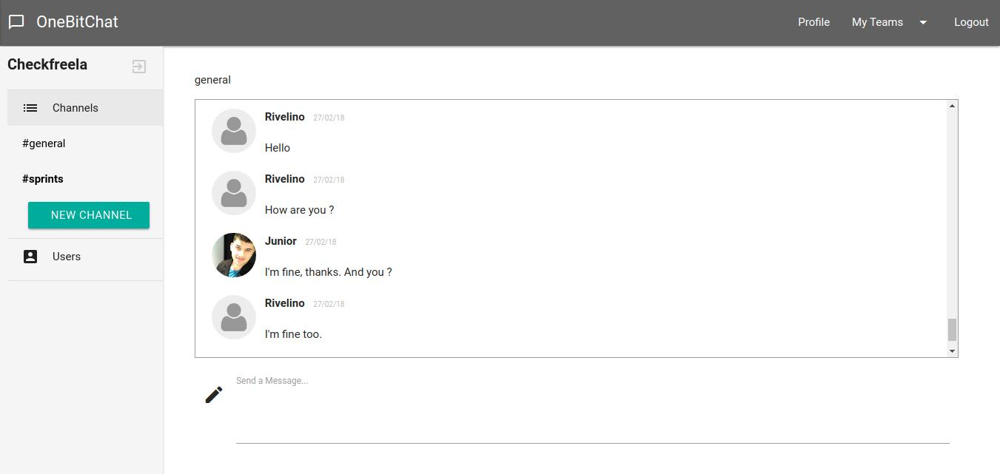

# About

A collaborative chat system for teams where users can create channels or conversations private with other users.



## Purpose

This project has with purpose the learning new skills. The project was developed following the lessons of bootcamp in the [OneBitCode](onebitcode.com), with exception of some features that was developed for to conclude the challenges proposed. Follow the features developed for me (challenges):  
* Allow the user to leave of the team.
* Invite an user to join your team.
* Allow the user to upload your avatar.
* Show in highlight the channels and talks with new messages.

## Prerequisites

* Docker
* Docker Compose

## Getting started

The steps below will help you in the building this project in the development and test environment:

### 1. Clone the Project
```
git clone git@github.com:rivelinojunior/bootcampSFS-clone-slack.git
```

### 2. Building the project with docker/docker-compose
```
  docker-compose up --build
```

### 3. Access the application in your browser
> localhost:3000

## Running the test
```
docker-compose run --rm website bundle exec rspec
```

## Building with the technologies
* Ruby on Rails
* Postgresql
* Docker / Docker Compose
* Rspec
* Action Cable
* Redis
* Devise

## Credits
* Rivelino Junior - [@rivelinojunior](http://github.com/rivelinojunior)
* Onebitcode - [blog](http://www.onebitcode.com)